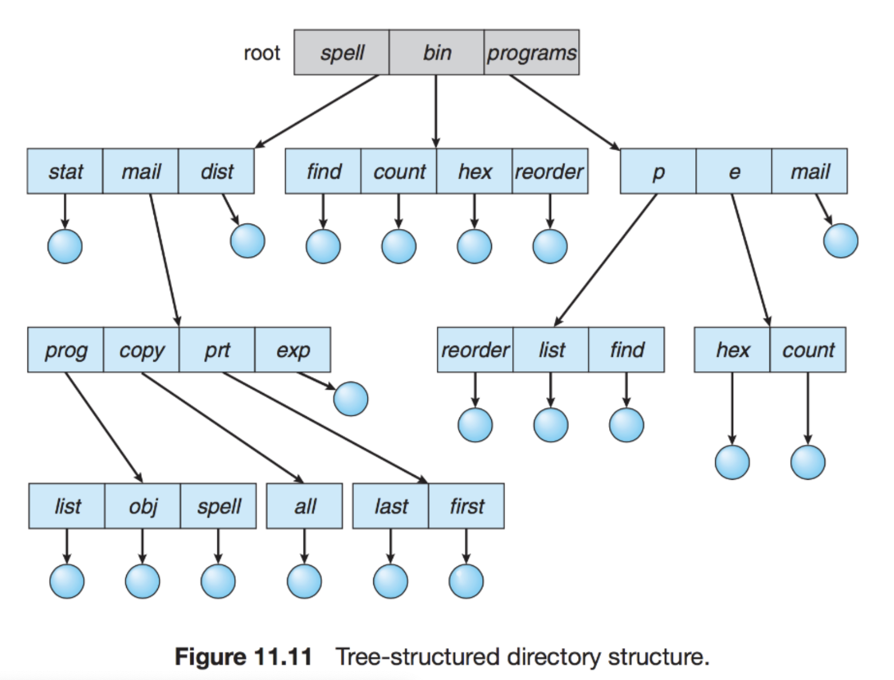

# TL;DR

- `파일` : 보조기억장치에 저장된 관련된 데이터 레코드들의 집합에 이름을 붙인 것
- `파일 속성` 또는 `파일 메타데이터` : 파일을 관리하기 위한 각종 정보들로 파일 자체의 내용은 아님   

- `디렉터리` : 모여있는 파일의 정보를 담고 있는 `파일` 로 파일을 관리하고 추적하기 위해 사용함
- `절대 경로` : root 로부터 목적지까지의 절대적인 경로
- `상대 경로` : 현재 위치를 기준으로 목적지까지의 경로   

# 파일 관리

- 프로세스 주소 공간에만 정보를 저장하면 다음과 같은 문제점이 발생한다.
  - 제한된 양만 저장이 가능하고,
  - 프로세스 종료시 정보가 사라지며
  - 다수의 프로세스가 동시에 정보에 접근하기 어렵다. 

- 따라서 `Long-term Information Storage` 의 필요성이 대두되었다.
  - `디스크`에 정보를 저장하면 메인 메모리보다 더 많은 정보를 저장할 수 있고,
  - 프로세스가 종료되어도 정보가 사라지지 않으며
  - 다수의 프로세스에서 정보를 동시에 접근할 수 있다.   

그렇다면 디스크에서 어떻게 정보를 찾고, 동기화 문제를 해결할 수 있을까?  
이 문제를 `파일`이란 새로운 추상화를 통해 해결한다. 
즉, `파일 시스템`은 디스크에 존재하는 데이터를 저장하고 접근할 수 있는 기법을 제공한다.    

# 1. 파일

### 파일이란?

- "A named collection of related information"

- 파일이란 `보조기억장치`에 저장된 **관련된 데이터 레코드들의 집합**이다.  

> ☝️ 여기서 잠깐!  
>
> 그럼 PC에서 사용하는 `파일`이란 단어는 무엇일까?  
>
> PC에서의 파일은 **시스템 사용자가 이용할 수 있는 데이터의 실체**를 의미한다.  
>
> 그러나 사실 시스템도, 응용 프로그램도, 디스크에 저장되는 모든 단위는 파일이다.  
>
> 운영체제는 다양한 저장 장치를 동일한 단위로 구분하기 위해 `file`이라는 단위를 사용하는 것이다. 

 

- 모든 파일은 0과 1의 비트 패턴으로 이루어지고 크게 실행 파일과 데이터 파일로 나뉨
- 파일의 이름은 `파일 이름.확장자` 형태로 구성됨   

+) **실행 파일**

- 운영체제가 메모리로 가져와 CPU를 이용하여 작업을 하는 파일

- 사용자의 요청으로 프로세스가 된 파일을 의미한다.   

+) **데이터 파일** 

- 실행 파일이 작업하는데 필요한 데이터를 모아놓은 파일

- 스스로 프로세스가 될 수 없고, 전송되거나 보관만 됨

- ex) 이미지 뷰어 프로그램의 사진 파일, 뮤직 플레이어의 음악 파일 등   

### 파일의 설계

- 각 파일이 어떤 `속성`(파일 이름, 파일의 종류, 용량, 접근 시간 등)들을 가지게 할 것인지
- 각 파일에 저장될 데이터를 어떤 형식으로 저장하고 처리해야 효율적인지
- 파일을 어떤 `구조`로 편성할 것인지  

위와 같은 파일의 `속성`, `연산`, `구조` 등은 운영체제마다 다르다.

<b>파일의 속성 File Attribute</b>

  
파일의 속성들은 각 `파일 헤더`에 기록되며, 운영체제는 파일 헤더를 `파일 테이블`에서 관리한다. 		  

- name : 확장자를 포함한 전체 이름을 의미
- type : 실행 파일, 동영상 파일, 사진 파일 등 확장자로 구분
- size : 파일 용량을 의미
- time : 파일 접근 시간을 의미하며 만든 시간, 변경 시간, 최근 열어본 시간 등으로 세분화 
- location : 파일의 위치, 이름과 확장자가 같은 두 파일은 한 디렉터리에 존재할 수 없음 
- accessibility : 파일의 접근 권한을 의미  
- owner : 파일의 소유자라는 의미, 윈도우에는 거의 없지만 유닉스에서는 자주 사용됨   

운영체제가 관리하는 파일 헤더 외에 데이터 파일마다 자신에게 필요한 속성을 따로 정의할 때 `고유 헤더`를 사용한다.

  

<b>파일의 연산 File Operation</b>

       

파일 자체를 변경하거나, 파일의 내용을 변경하는 작업들을 말한다.  
  

  

  

<b>파일의 구조 File Structure</b>

       

### 순차 파일 구조
  
파일의 내용이 하나의 긴 줄로 늘어선 형태   

#### 장점
- 모든 데이터가 순차적으로 기록되기 때문에 저장 공간 낭비가 없음
- 구조가 단순함
- 순서대로 데이터를 읽거나 저장할 때 매우 빠르다.  
  
#### 단점 
- 파일에 새로운 데이터를 삽입하거나 삭제할 때 오래 걸림
- 특정 데이터로의 이동 시 직접 접근이 어려워 데이터 검색에 적절하지 않음   

### 인덱스 파일 구조
  
인덱스 테이블을 이용해 순차 접근과 직접 접근이 가능한 형태  
현대의 파일 시스템은 인덱스 파일 구조로, 파일을 저장할 땐 순차 파일 구조로, 파일에 접근할 땐 인덱스 테이블을 보고 파일에 직접 접근한다.  
 
#### 장점
- 인덱스 테이블을 통해 다양한 접근이 가능
- 많은 양의 데이터를 처리할 때 효율적  
  
#### 단점 
- 인덱스 테이블을 위한 추가 저장 공간이 필요
- 인덱스 참조 시간이 추가됨   

  
### 집적 파일 구조
  
저장하려는 데이터의 특정 값에 어떤 관계를 정의해 물리적인 주소로 바로 변환하는 파일 구조  
해시 함수를 이용해 직접 접근이 가능한데 실제로 많이 쓰이진 않는다.  
  
#### 장점
- 해시 함수를 이용해 주소를 변환하므로 데이터 접근이 빠르다  
  
#### 단점 
- 해시 함수를 찾기 어렵다
- 해시 함수를 잘 찾아도 저장 공간이 낭비될 수 있다   

  

  

# 2. 디렉터리

### 디렉터리란?

- 파일을 관리하고 추적하기 위해 사용하는 개념

- 관련있는 파일을 하나로 모아놓은 곳이다.
- 디렉터리는 여러 층으로 구성되고 최상위에 루트 디렉터리가 있다.   

> ☝️ 여기서 잠깐!  
>
> 디렉터리는 새로운 단위인가요? No!  
>
> `디렉터리`는 '모여있는 파일의 정보'를 담는 `파일` 입니다.

  

#### 경로

- `절대 경로` : 루트 디렉토리를 기준으로 파일의 위치를 나타내는 방식  

​		ex) /program/data/exam.c

- `상대 경로` : 현재 있는 위치를 기준으로 파일의 위치를 표시  

​		ex) data/exam.c   

#### 디렉터리 구조

디렉터리의 구조

       

### 1단계 디렉터리 구조

  

가장 간단한 구조의 디렉터리로 각 파일은 사용자가 다르더라도 서로 유일한 이름을 가져야 한다.  

파일이 많아지거나 다수의 사용자가 사용하면 심각한 제약이 따른다.   

### 2단계 디렉터리 구조

  

사용자 별로 디렉터리를 만들어 관리하는 방법이다.  

사용자의 이름이나 계정 번호로 색인을 하고, 각 엔트리는 사용자 파일 디렉터리를 가리킨다.  

파일 참조 시 사용자의 파일 디렉터리에서만 탐색하므로 파일 이름 충돌 문제가 발생하지 않지만, 다른 사용자 파일에 접근해야 할 경우 단점이 된다.   

### 트리 디렉터리 구조

  

2단계 디렉터리 구조를 확장해 다단계 트리 구조로 만든다.  

사용자들이 자신의 서브 디렉터리를 만들어 파일을 구성할 수 있도록 한다.  

디렉터리의 각 항목은 일반 파일인지(0) 디렉터리 파일인지(1) 항목을 추가해 구분한다.   

### 그래프 디렉터리 구조

  

디렉터리들이 서브 디렉터리와 파일을 공유할 수 있도록 허용한다.  

트리 구조의 디렉터리를 일반화한 방식으로 `링크` 라고 불리는 새로운 디렉터리 항목을 통해 파일을 공유한다.

  
